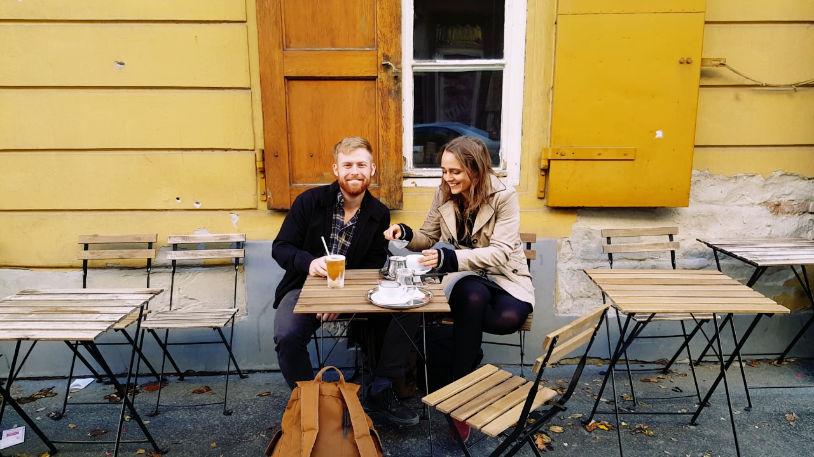
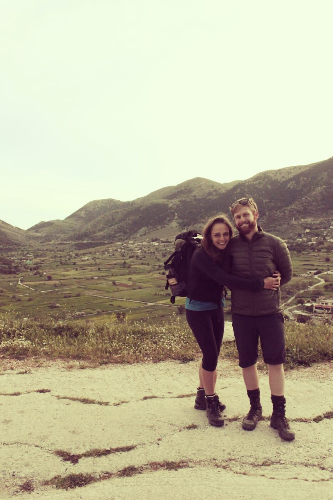
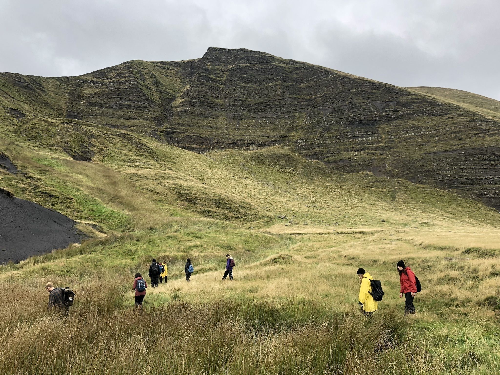
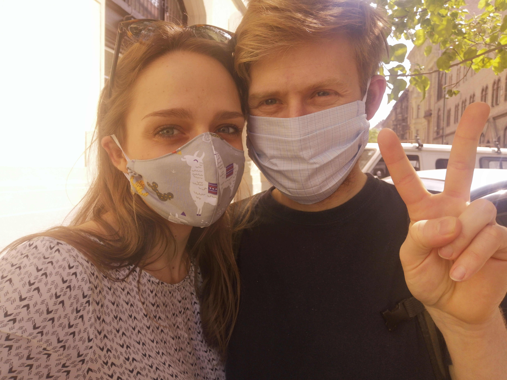
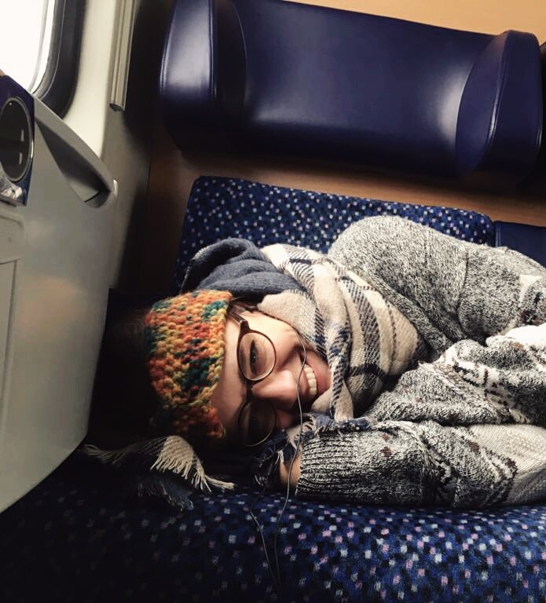
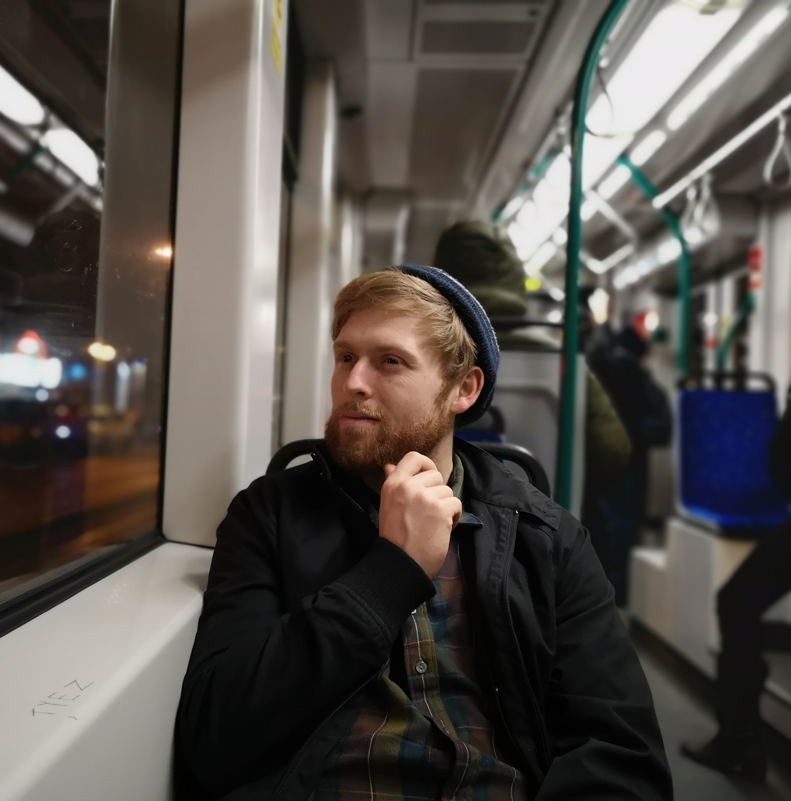
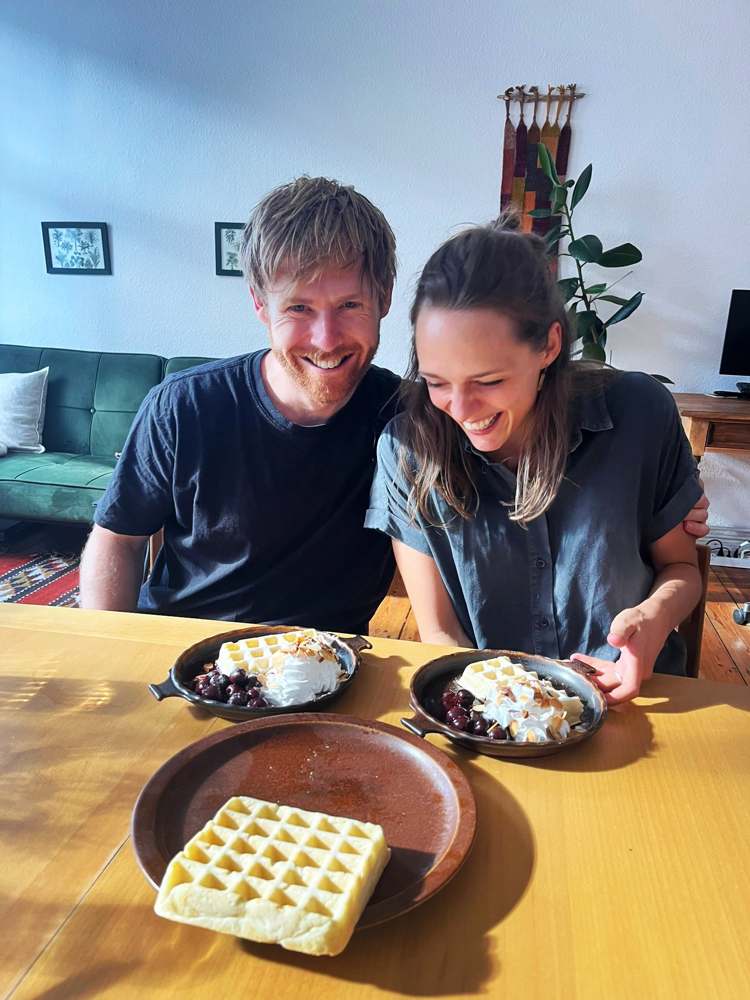
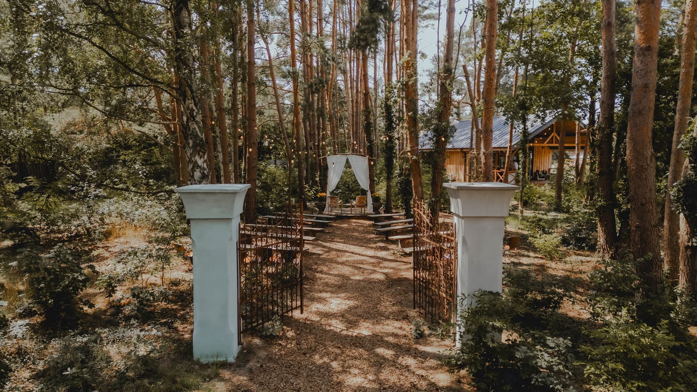

:::: hero
# Janna and Ben's Wedding

<div>

</div>

<!-- spacer -->

[RSVP](https://janna-and-ben.github.io/index.html#rsvp){.hero-btn}
::::

::: {style="margin-top: 4rem;"}
:::

# Until the Wedding {.section-title}

```{=html}
<div class="wedding-countdown">
  <div id="wedding-countdown">
    <div class="countdown-card">
      <div class="countdown-display">
        <div class="countdown-section">
          <div id="countdown-days" class="countdown-value">00</div>
          <div class="countdown-label">Days</div>
        </div>
        <div class="countdown-section">
          <div id="countdown-hours" class="countdown-value">00</div>
          <div class="countdown-label">Hours</div>
        </div>
        <div class="countdown-section">
          <div id="countdown-minutes" class="countdown-value">00</div>
          <div class="countdown-label">Minutes</div>
        </div>

      </div>
    </div>
  </div>
</div>
```

# Our Story {.section-title}

```{=html}
<!-- ============================================ -->
<!-- Bootstrap Dependencies -->
<!-- ============================================ -->
<link href="https://cdn.jsdelivr.net/npm/bootstrap@5.3.0/dist/css/bootstrap.min.css" rel="stylesheet" integrity="sha384-9ndCyUaIbzAi2FUVXJi0CjmCapSmO7SnpJef0486qhLnuZ2cdeRhO02iuK6F" crossorigin="anonymous">
<script src="https://cdn.jsdelivr.net/npm/bootstrap@5.3.0/dist/js/bootstrap.bundle.min.js" integrity="sha384-geWF76RCwLtnZ8qwWowPQNguL3RmwHVBC9FhGdlKrxdiJJigb/j/68SIy3Te4" crossorigin="anonymous"></script>

<!-- Font Awesome Icons -->
<link rel="stylesheet" href="https://cdnjs.cloudflare.com/ajax/libs/font-awesome/6.5.1/css/all.min.css" integrity="sha512-DTOQO9RWCH3ppGqcWaEA1BIZOC6xxalwEsw9c2QQeAIftl+Vegovlnee1c9QX4TctnWMn13TZye+giMm8e2LwA==" crossorigin="anonymous" referrerpolicy="no-referrer" />

<!-- ============================================ -->
<!-- Journey Timeline Carousel -->
<!-- Shows our story progression through different cities -->
<!-- ============================================ -->
<!-- ============================================ -->
<section class="timeline">
  <div class="container">
    <div id="carouselExampleIndicators" class="carousel slide" data-ride="carousel">
      
      <!-- Timeline Navigation Buttons -->
      <!-- Progressive dots and line show journey completion -->
      <ol class="carousel-indicators">
        <button type="button" data-bs-target="#carouselExampleIndicators" data-bs-slide-to="0" class="active" aria-current="true" aria-label="Slide 1">
          <h4 class="carousel-location-label">Budapest</h4>
        </button>
        <button type="button" data-bs-target="#carouselExampleIndicators" data-bs-slide-to="1" aria-label="Slide 2">
          <h4 class="carousel-location-label">Lesvos</h4>
        </button>
        <button type="button" data-bs-target="#carouselExampleIndicators" data-bs-slide-to="2" aria-label="Slide 3">
          <h4 class="carousel-location-label">Manchester</h4>
        </button>
        <button type="button" data-bs-target="#carouselExampleIndicators" data-bs-slide-to="3" aria-label="Slide 4">
          <h4 class="carousel-location-label">Budapest</h4>
        </button>
        <button type="button" data-bs-target="#carouselExampleIndicators" data-bs-slide-to="4" aria-label="Slide 5">
          <h4 class="carousel-location-label">Zürich</h4>
        </button>
        <button type="button" data-bs-target="#carouselExampleIndicators" data-bs-slide-to="5" aria-label="Slide 6">
          <h4 class="carousel-location-label">In Between</h4>
        </button>
        <button type="button" data-bs-target="#carouselExampleIndicators" data-bs-slide-to="6" aria-label="Slide 7">
          <h4 class="carousel-location-label">Berlin</h4>
        </button>
      </ol>
      
      <!-- Carousel Slides -->
      <div class="carousel-inner">
        
        <!-- Slide 1: Budapest - Where it all began -->
        <div class="carousel-item active">
          <div class="experience-slide-one row h-100 align-items-center">
            <div class="col-md-5">
              <div class="experience-slide-img">
                
              </div>
            </div>
            <div class="col-md-7">
              <div class="experience-slide-text">
                <h3>Budapest 2018</h3>
                <p>Our story began on the streets of Budapest, when Janna passed Ben on the street before doubling back and introducing herself with a paper map in hand, which Ben found deeply endearing. Our first date took place the very next day, when Janna invited Ben to a cemetery. Where else would a great romance begin? Over the next few months there were long afternoons studying in dubiously decorated university computer rooms, shared dinners at each other’s apartments (one of the only times Janna voluntarily offered to cook). We also went on our first hike together in the Buda Hills, unaware that it would be the first of many outings involving mountains and an optimistic underestimation of distances. </p>
              </div>
            </div>
          </div>
        </div>
        
        <!-- Slide 2: Lesvos -->
        <div class="carousel-item">
          <div class="experience-slide-one row h-100 align-items-center">
            <div class="col-md-5">
              <div class="experience-slide-img">
                
              </div>
            </div>
            <div class="col-md-7">
              <div class="experience-slide-text">
                <h3>Lesvos 2019</h3>
                <p>The second semester of our master’s degree took us to the island of Lesvos, a move that was more than just geographic, as it also marked the moment we began living together. This brought new experiences, like doing the weekly food shop side by side, although this did not last long, as Ben quickly learned that Janna “helping” with the shopping usually substantially increased the total time required. Much more exciting was our first real holiday together, hiking between coastal towns in Crete with friends, spending long days on steep climbs, fueled by trail mix, and with Janna’s primary form of sun protection being a button-up shirt converted into a headscarf.</p>
              </div>
            </div>
          </div>
        </div>
        
        <!-- Slide 3: Manchester -->
        <div class="carousel-item">
          <div class="experience-slide-one row h-100 align-items-center">
            <div class="col-md-5">
              <div class="experience-slide-img">
                
              </div>
            </div>
            <div class="col-md-7">
              <div class="experience-slide-text">
                <h3>Manchester 2019</h3>
                <p>The next destination was Manchester, which, despite being a brief sojourn, provided more than enough rain for two lifetimes. Janna was baffled by the native Mancunians’ seeming inability to understand her, but was reassured when Ben confirmed that this was more a “them” problem than anything to do with her. This period also marked the beginning of Ben’s great love story with R and coding, a relationship that became very serious very quickly. Ironically, Janna’s strongest moment of appreciation for the rugged landscapes of northern England came only when we were on the train leaving Manchester behind.</p>
              </div>
            </div>
          </div>
        </div>
        
        <!-- Slide 4: Back to Budapest -->
        <div class="carousel-item">
          <div class="experience-slide-one row h-100 align-items-center">
            <div class="col-md-5">
              <div class="experience-slide-img">
                
              </div>
            </div>
            <div class="col-md-7">
              <div class="experience-slide-text">
                <h3>Back to Budapest 2020</h3>
                <p>Our return to Budapest in time to enjoy a glorious spring was somewhat thwarted by the arrival of COVID. Suddenly, life shrank to a small apartment and the writing of our theses in isolation. The daily highlight became an expedition to the nearby supermarket to buy a vegan Magnum, which was then eaten in the small adjacent park. Although, even this was soon brought to an abrupt end, as we watched from our window while the police chained the park gates shut, to the dismay of a crowd of onlooking children. Yet all that time together strengthened our relationship, in part through strange indoor projects such as attempting to construct a Rube Goldberg machine to record an elaborate birthday message for a friend (only to give up after about an hour once we realized that building such a thing is incredibly difficult).</p>
              </div>
            </div>
          </div>
        </div>
        
        <!-- Slide 5: Zurich -->
        <div class="carousel-item">
          <div class="experience-slide-one row h-100 align-items-center">
            <div class="col-md-5">
              <div class="experience-slide-img">
                
              </div>
            </div>
            <div class="col-md-7">
              <div class="experience-slide-text">
                <h3>Zürich 2020</h3>
                <p>In late 2020, both of us were fortunate enough to find PhD positions starting nearly at the same time in Zurich, although it must be said that Janna was far more proactive, while Ben’s came more through luck. After years in cities that were lovable but pretty run down, Zürich felt like another world, with pristine waterways running through the center and streets that smell like floral bath bombs. Many weekends were spent taking increasingly long train journeys to hike in the mountains, often surprised and underprepared for the weather at altitude. At some point, Janna decided that the ivory tower of academia was not for her and chose to leave her PhD behind in order to have more impact in the real world.</p>
              </div>
            </div>
          </div>
        </div>

        <!-- Slide 6: Half N Half -->
        <div class="carousel-item">
          <div class="experience-slide-six">
            <div class="experience-slide-img-dual">
              
              
            </div>
            <div class="experience-slide-text experience-slide-six-text">
              <h3>The half way between years</h3>
              <p>Janna started a new job in Berlin, while Ben continued in Zurich. Two years of long-distance journeys back and forth followed, with Deutsche Bahn playing an unpredictable third wheel in our relationship. Countless hours were spent in purgatory on train platforms, waiting for delayed trains throughout Germany (never in Switzerland, of course). However, this period also made the time we had together feel more intentional. And without Ben to do the cooking, Janna also rediscovered her love of “girl dinner” and eating chickpeas straight from the can.</p>
            </div>
          </div>
        </div>
        
        <!-- Slide 7: Berlin - Our current home -->
        <div class="carousel-item">
          <div class="experience-slide-one row h-100 align-items-center">
            <div class="col-md-5">
              <div class="experience-slide-img">
                
              </div>
            </div>
            <div class="col-md-7">
              <div class="experience-slide-text">
                <h3>Berlin 2024</h3>
                <p>Now we have started a new chapter of our life together in Berlin. Of course, some things haven’t changed at all. Janna still believes there’s no such thing as too many pairs of socks in winter. Ben continues to buy broccoli but refuses to cook it, and he is always happy to return to the same favourite books again and again. At the same time, we’re still discovering new things about each other. Ben can happily spend hours tending to his fermentation projects and has a habit of automating and programming absolutely everything — including this website and the invitations. Janna, meanwhile, will seize any opportunity to put her feet up, even during activities such as brushing her teeth. She is also slowly dipping her toes into cycling on the bike Ben built for her — which, at the time of writing, is hibernating peacefully in the cellar for the winter. Its time will come.</p>
              </div>
            </div>
          </div>
        </div>
        
      </div>
      
      <!-- Carousel Navigation Controls -->
      <a class="carousel-control-prev" href="#carouselExampleIndicators" role="button" data-bs-slide="prev">
        <span class="carousel-control-prev-icon" aria-hidden="true"></span>
        <span class="visually-hidden">Previous</span>
      </a>
      <a class="carousel-control-next" href="#carouselExampleIndicators" role="button" data-bs-slide="next">
        <span class="carousel-control-next-icon" aria-hidden="true"></span>
        <span class="visually-hidden">Next</span>
      </a>
      
    </div>
  </div>
</section>
```

# The Plan {.section-title}

::: {.general-text}
We're only planning on getting married once so we thought why not make a bit of an event of it, especially as many of you will be travelling quite a distance to be there. This is why, we have opted for the rather trendy approach of making it a 'Woliday' — a wedding spanning multiple days, allowing us to spend more quality time with all of you. The <a href="#sec-venue">venue</a> is a beautiful farmhouse with accomodation, and plenty of outdoor space, so we're are looking forward to a relaxed few days full of food, games, and celebrations. You can arrive from midday on the 7th of July and stay until early afternoon on the 9th, with the main event itself taking place on the 8th. 

Of course, we recognise that not everyone will be able to make it for the whole time, and if you can only come for part of the time e.g the dinner on the night before, or just for the ceremony, that’s absolutely fine. There is no pressure and you’re very welcome to join us for as much or as little as you’d like!

Below we have provided a rough plan of what the three days will look like but it certainly isn't set in stone and there will probably be some improvisation, for example, we hope to do most activities outside but the weather might have other plans.  
:::

```{=html}
<section class="bsb-timeline-2">
  <div class="container">
    <div class="three-timelines-wrapper">

      <!-- ── Left: The Day Before ── -->
      <div class="timeline-column">
        <h3 class="timeline-column-title">The Day Before</h3>
        <ul class="timeline">
          <li class="timeline-item">
            <span class="timeline-icon"><i class="fas fa-cart-flatbed-suitcase"></i></span>
            <div class="timeline-body">
              <h2 class="card-title mb-3">From 13:00</h2>
              <h2 class="card-subtitle text-secondary mb-1">Arrival & Settling In</h2>
              <p class="card-text m-0">Arrive at Farmhouse Wandlitz any time you’d like and when the Deutsche Bahn gods get you there. We’ll be here from 13:00</p>
            </div>
          </li>
          <li class="timeline-item">
            <span class="timeline-icon"><i class="fas fa-table-tennis-paddle-ball"></i></span>
            <div class="timeline-body">
              <h2 class="card-title mb-3">14:00-18:00</h2>
              <h2 class="card-subtitle text-secondary mb-1">Chill afternoon</h2>
              <p class="card-text m-0">Having a good time playing volleyball or table tennis, setting up and decorating, reading, soaking in the sunlight (hopefully) and playing games.</p>
            </div>
          </li>
          <li class="timeline-item">
            <span class="timeline-icon"><i class="fas fa-utensils"></i></span>
            <div class="timeline-body">
              <h2 class="card-title mb-3">19:00</h2>
              <h2 class="card-subtitle text-secondary mb-1">Dinner</h2>
              <p class="card-text m-0">Getting to know each other and sharing a nice home-made dinner together. </p>
            </div>
          </li>
        </ul>
      </div>

      <!-- ── Centre: The Day Of ── -->
      <div class="timeline-column timeline-column-center">
        <h3 class="timeline-column-title">The Day Of</h3>
        <ul class="timeline">
          <li class="timeline-item">
            <span class="timeline-icon"><i class="fas fa-bread-slice"></i></span>
            <div class="timeline-body">
              <h2 class="card-title mb-3">10:00 - 11:30</h2>
              <h2 class="card-subtitle text-secondary mb-1">Brunch</h2>
              <p class="card-text m-0">A relaxed brunch to fuel up for the day. Then some time for you: go to a nearby lake, have a nap, or start your getting-ready routine. </p>
            </div>
          </li>
          <li class="timeline-item">
            <span class="timeline-icon"><i class="fas fa-door-open"></i></span>
            <div class="timeline-body">
              <h2 class="card-title mb-3">14:30 - 15:00</h2>
              <h2 class="card-subtitle text-secondary mb-1">Arrival</h2>
              <p class="card-text m-0">For those not staying the evening before.</p>
            </div>
          </li>
          <li class="timeline-item">
            <span class="timeline-icon"><i class="fas fa-heart"></i></span>
            <div class="timeline-body">
              <h2 class="card-title mb-3">15:00 - 15:45</h2>
              <h2 class="card-subtitle text-secondary mb-1">Wedding Ceremony</h2>
              <p class="card-text m-0">Join us for the ceremony as we tie the knot.</p>
            </div>
          </li>
          <li class="timeline-item">
            <span class="timeline-icon"><i class="fas fa-cake-candles"></i></span>
            <div class="timeline-body">
              <h2 class="card-title mb-3">15:45 - 18:00</h2>
              <h2 class="card-subtitle text-secondary mb-1">Reception</h2>
              <p class="card-text m-0">Afternoon coffee and cake followed by games and other shenanigans.</p>
            </div>
          </li>
          <li class="timeline-item">
            <span class="timeline-icon"><i class="fas fa-utensils"></i></span>
            <div class="timeline-body">
              <h2 class="card-title mb-3">18:00 - 20:00</h2>
              <h2 class="card-subtitle text-secondary mb-1">Dinner</h2>
              <p class="card-text m-0">The main wedding dinner, hopefully outdoors as a relaxed buffet.</p>
            </div>
          </li>
          <li class="timeline-item">
            <span class="timeline-icon"><i class="fas fa-music"></i></span>
            <div class="timeline-body">
              <h2 class="card-title mb-3">20:00 - 20:30</h2>
              <h2 class="card-subtitle text-secondary mb-1">Ceilidh</h2>
              <p class="card-text m-0">A fun group dance to get everyone on their feet.</p>
            </div>          
          </li>
          <li class="timeline-item">
            <span class="timeline-icon"><i class="fas fa-champagne-glasses"></i></span>
            <div class="timeline-body">
              <h2 class="card-title mb-3">20:30 - Whenever</h2>
              <h2 class="card-subtitle text-secondary mb-1">Party</h2>
              <p class="card-text m-0">Dance the night away!</p>
            </div>
          </li>
        </ul>
      </div>

      <!-- ── Right: The Morning After ── -->
      <div class="timeline-column">
        <h3 class="timeline-column-title">The Day After</h3>
        <ul class="timeline">
          <li class="timeline-item">
            <span class="timeline-icon"><i class="fas fa-mug-hot"></i></span>
            <div class="timeline-body">
              <h2 class="card-title mb-3">10:00-12:00</h2>
              <h2 class="card-subtitle text-secondary mb-1">Brunch</h2>
              <p class="card-text m-0">A lazy morning brunch, according to your sleep needs.</p>
            </div>
          </li>
          <li class="timeline-item">
            <span class="timeline-icon"><i class="fas fa-person-walking"></i></span>
            <div class="timeline-body">
              <h2 class="card-title mb-3">Late Morning</h2>
              <h2 class="card-subtitle text-secondary mb-1">Stroll & Recovery</h2>
              <p class="card-text m-0">Feel free to take a walk or just chill.</p>
            </div>
          </li>
          <li class="timeline-item">
            <span class="timeline-icon"><i class="fas fa-bicycle"></i></span>
            <div class="timeline-body">
              <h2 class="card-title mb-3">By 14:00</h2>
              <h2 class="card-subtitle text-secondary mb-1">Farewell</h2>
              <p class="card-text m-0">Safe travels home — thank you for celebrating with us!</p>
            </div>
          </li>
        </ul>
      </div>

    </div>
  </div>
</section>
```

# The Location {.section-title #sec-venue}

```{=html}
<div class="container">
  <!-- Text on top -->
  <div class="row mb-4">
    <div class="col-12">
      <p class="general-text">Our wedding will take place at the lovely <a href="https://www.farmhousewandlitz.com/" target="_blank">Farmhouse Wandlitz</a>, just outside of Berlin. Below you can find a map to help you find the venue. If you are travelling via public transport from Berlin the Basdorf station is the closest stop, from there it is a 8 minute walk to the venue.</p>
    </div>
  </div>
  
  <!-- Image and Map side by side -->
  <div class="row location-media-row">
    <div class="col-md-6 location-image-col">
      
    </div>
    <div class="col-md-6 location-map-col">
      <div class="location-map">
        <iframe src="https://maps.google.com/maps?width=600&amp;height=400&amp;hl=en&amp;q=Farmhouse wandlitz&amp;t=&amp;z=12&amp;ie=UTF8&amp;iwloc=B&amp;output=embed" frameborder="0" scrolling="no" marginheight="0" marginwidth="0" class="gmap_iframe"></iframe>
      </div>
    </div>
  </div>
</div>
```

# Where to stay {.section-title}

::: {.general-text}
As mentioned, there are a variety of accomodation options at the venue itself but also in the nearby town which are described below. Obviously, the number of beds at the venue are limited so we have included an option to specify your preference in the <a href="#sec-rsvp" >RSVP</a> and we will do our best to try and make everyone's preferred option work. If you have any questions about accomodation or need help finding something please don't hesitate to reach out to us.
:::

```{=html}


<div class="container">
  <div class="row g-4">
    <!-- Card 1: Camping -->
    <div class="col-md-4">
      <div class="stay-card-wrapper">
        <div class="stay-card">
          <!-- Front of card -->
          <div class="stay-card-front">
            <div class="card-img-overlay-bg" style="background-image: url('media/camping.jpg');"></div>
            <div class="card-body">
              <div class="card-icon">
                <i class="fas fa-campground"></i>
              </div>
              <h3 class="card-title">Camping</h3>
            </div>
          </div>
          <!-- Back of card -->
          <div class="stay-card-back">
            <div class="card-img-overlay-bg" style="background-image: url('media/camping.jpg');"></div>
            <div class="card-body">
              <p class="card-text">Pitch your own tent in a quiet spot at the back of the grounds. There are multiple bathrooms with showers nearby for you to use. 10 Euro per person per night</p>
            </div>
          </div>
        </div>
      </div>
    </div>
    
    <!-- Card 2: Glamping -->
    <div class="col-md-4">
      <div class="stay-card-wrapper">
        <div class="stay-card">
          <!-- Front of card -->
          <div class="stay-card-front">
            <div class="card-img-overlay-bg" style="background-image: url('media/yurt.jpg');"></div>
            <div class="card-body">
              <div class="card-icon">
                <i class="fas fa-tent"></i>
              </div>
              <h3 class="card-title">Glamping</h3>
            </div>
          </div>
          <!-- Back of card -->
          <div class="stay-card-back">
            <div class="card-img-overlay-bg" style="background-image: url('media/yurt.jpg');"></div>
            <div class="card-body">
              <p class="card-text">There are two yurts available with two single beds each, as well as a caravan for two. 80 Euro per 'room' per night</p>
            </div>
          </div>
        </div>
      </div>
    </div>
  
    
    <!-- Card 4: On-site rooms -->
    <div class="col-md-4">
      <div class="stay-card-wrapper">
        <div class="stay-card">
          <!-- Front of card -->
          <div class="stay-card-front">
            <div class="card-img-overlay-bg" style="background-image: url('media/room.jpg');"></div>
            <div class="card-body">
              <div class="card-icon">
                <i class="fas fa-bed"></i>
              </div>
              <h3 class="card-title">On-site rooms</h3>
            </div>
          </div>
          <!-- Back of card -->
          <div class="stay-card-back">
            <div class="card-img-overlay-bg" style="background-image: url('media/room.jpg');"></div>
            <div class="card-body">
              <p class="card-text">There are: 6 double rooms and 5 twin rooms split between two buildings. 120 Euro per room per night</p>
            </div>
          </div>
        </div>
      </div>
    </div>
    
    <!-- Card 5: Nearby accomodation -->
    <div class="col-md-4">
      <div class="stay-card-wrapper">
        <div class="stay-card">
          <!-- Front of card -->
          <div class="stay-card-front">
            <div class="card-img-overlay-bg" style="background-image: url('media/hotel.jpg');"></div>
            <div class="card-body">
              <div class="card-icon">
                <i class="fas fa-hotel"></i>
              </div>
              <h3 class="card-title">Nearby hotels</h3>
            </div>
          </div>
          <!-- Back of card -->
          <div class="stay-card-back">
            <div class="card-img-overlay-bg" style="background-image: url('media/hotel.jpg');"></div>
            <div class="card-body">
              <p class="card-text">There are several hotels in nearby Wandlitz and Basdorf such as <a href="http://www.barnimerhof.de/index.php?lang=de" target="_blank">Hotel Barnimer Hof</a> which is 1km walk away. Approx. 120 Euro per double room per night</p>
            </div>
          </div>
        </div>
      </div>
    </div>
  </div>
</div>
```

# What to wear and what to bring {.section-title}


::: {.general-text}
**Bring**: Anything that tickles your fancy! Musical instruments, games, books, you name it. The venue has a hot tub and a sauna, so don't forget your swimwear. There’s also a beach volleyball court and a table tennis table, so if you have a lucky bat or pair of shorts, feel free to bring them along. July weather in Berlin can be a bit unpredictable, so it’s worth checking the forecast before packing your sunscreen, your rain jacket… or both.

**Wear**: Anything that tickles your fancy! Make sure to wear something that makes you feel fabulous and that allows you to dance the night away.

**Gifts**: Celebrating with you is truly the most important thing to us. For those who have already asked about gifts: we are hoping to take a bigger trip at some point in the future so if you wish, a small contribution towards this would mean a lot to us. Or perhaps you’d prefer to share your talents by contributing to the entertainment, food, or décor of the wedding.
:::

# Let's get you on the dance floor {.section-title}

```{=html}
<p class="general-text">	Add your favourite songs to the playlist here  <a href="https://open.spotify.com/playlist/6lcvHlV9jRY6rNHZp8keDb?si=79646422b43649cc" target="_blank">here</a></p>

<div class="spotify-wrapper">
  <iframe data-testid="embed-iframe" src="https://open.spotify.com/embed/playlist/6lcvHlV9jRY6rNHZp8keDb?utm_source=generator" width="100%" height="552" frameBorder="0" allowfullscreen="" allow="autoplay; clipboard-write; encrypted-media; fullscreen; picture-in-picture" loading="lazy">></iframe>
</div>
```

# RSVP Here {#sec-rsvp .section-title}

::: {.general-text}
Please RSVP by [**31st March**]{.underline} to help us with planning. We hope you can make it!
:::

<iframe src="https://docs.google.com/forms/d/e/1FAIpQLSeQDhR8QXycW7fzdvty_sV5ArX5RcyV-sA0XwfE2L0vOhDZsw/viewform?embedded=true" width="100%" height="1044" frameborder="0" marginheight="0" marginwidth="0">

</iframe>

```{=html}
<meta name="wedding-date" content="">
<script src="wedding-countdown.js"></script>
```